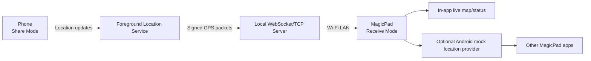

# MagicPad GPS Sharing App - Design Document

## 1. Feasibility Summary

This is possible on stock Android, with an important limitation:

- A single app can run on both devices, with the phone acting as the GPS source and the Honor MagicPad acting as the receiver.
- The two devices can communicate over the same Wi-Fi network using local TCP/WebSocket traffic, with Android Network Service Discovery (NSD/mDNS) for automatic discovery.
- The phone can collect live GPS data using Android location APIs and stream latitude, longitude, altitude, speed, bearing, accuracy, and timestamps to the MagicPad.
- The MagicPad can display and consume that GPS data inside this app without special system privileges.
- If the goal is for other apps on the MagicPad to receive the phone's GPS position as if it were the tablet's own location, the receiver app must use Android's mock location/test provider support. That requires the user to enable Developer Options and set this app as the selected mock location app on the MagicPad.
- Mocked locations can be detected by apps using `Location.isMock()`, so some navigation, banking, fleet, game, or compliance-sensitive apps may reject or degrade location data supplied this way.

Recommended initial product direction:

Build a single Kotlin Android app with two modes:

1. **Share Mode** on the phone: reads real GPS and streams signed location packets over local Wi-Fi.
2. **Receive Mode** on the MagicPad: discovers/connects to the phone, shows live status, and optionally feeds Android mock location so other apps can use it.

Primary target app on the MagicPad:

- **Google Maps**. Google Maps normally uses Android's system location service, so it should be able to follow the shared phone GPS when the receiver app is selected as the MagicPad's mock location app.
- This must be validated early on the actual MagicPad, because Google Maps may blend GPS, Wi-Fi, and network location signals, and Android marks mock locations in a way apps can detect.

## 2. Goals

- Provide live location data from an Android phone with GPS hardware to an Honor MagicPad on the same Wi-Fi network.
- Make Google Maps on the MagicPad show the phone's live GPS position through Android mock location.
- Use one installable app package for both devices.
- Allow either device to be configured as the location source or receiver, although the intended normal setup is phone source and MagicPad receiver.
- Avoid requiring internet, a cloud service, a user account, root access, or USB tethering.
- Make setup simple enough for repeated use: open app on phone, open app on MagicPad, pair/connect, start sharing.
- Provide clear status: connected, receiving, stale data, accuracy, battery impact, and mock-location readiness.

## 3. Non-Goals

- No remote tracking over the internet in the first version.
- No hidden/background tracking without an explicit foreground notification and user action.
- No attempt to bypass Android mock-location detection.
- No rooting, system app installation, privileged permissions, or OEM-specific hacks.
- No guarantee that every third-party app on the MagicPad will accept mock locations. Google Maps is the primary compatibility target.

## 4. Platform Facts That Shape The Design

### Location Capture

The source device should use Android's fused location provider for regular updates. Android's own documentation describes fused location updates as the standard way to receive periodic location updates containing latitude/longitude plus optional bearing, altitude, speed, and accuracy fields.

The app must request runtime location permission. For continuous sharing while the app is not visibly on screen, the phone should run a foreground service with a persistent notification. On modern Android versions, foreground services that access location must declare the `location` foreground service type and associated permissions.

### Local Wi-Fi Communication

Because both devices are on the same Wi-Fi network, the simplest transport is:

- Receiver and source connect over a local TCP socket.
- Use WebSocket framing or newline-delimited JSON over TLS-like authenticated encryption.
- Use NSD/mDNS so the MagicPad can find the phone automatically.

Android NSD is intended for apps to discover services offered by other devices on a local network. Android also supports Wi-Fi Direct, but that is more useful when the devices are not already on the same Wi-Fi network. Since the stated setup is same Wi-Fi, NSD plus TCP/WebSocket is the simpler primary route.

### MagicPad System Location Injection

Android has official test-provider APIs that can submit mock/fake locations via `LocationManager`. The same official reference notes that these locations can be received by applications that obtain location through Android's location framework, and that they are identifiable as mock locations.

This creates two receiver modes:

- **App-only mode:** the MagicPad app shows/uses the incoming GPS itself. No Developer Options needed.
- **System mock mode:** the MagicPad app writes incoming GPS into Android's location framework using a mock provider. Developer Options must be enabled and this app must be selected as the mock location app. Other apps may then see the shared position, subject to their own policies.

For this project, System Mock Mode is the important path because the target consumer is Google Maps on the MagicPad.

## 5. Proposed Architecture



## 6. App Modes

### 6.1 Share Mode - Phone

Responsibilities:

- Request foreground precise location permission.
- Start a foreground service when sharing begins.
- Read location updates at a configurable interval.
- Host a local service on the Wi-Fi network.
- Advertise the service with NSD.
- Show connection status and the receiving device name.
- Stop sharing quickly from the notification or app screen.

Suggested update settings:

- Walking/general use: every 1-2 seconds.
- Driving/navigation: every 500 ms to 1 second, if battery impact is acceptable.
- Stationary/power save: every 5-10 seconds.

Data captured:

- Latitude
- Longitude
- Horizontal accuracy
- Timestamp
- Elapsed realtime timestamp
- Altitude, if available
- Vertical accuracy, if available
- Speed, if available
- Speed accuracy, if available
- Bearing/course, if available
- Bearing accuracy, if available
- Provider/source quality

### 6.2 Receive Mode - MagicPad

Responsibilities:

- Discover source devices with NSD.
- Pair with a source using a short code or QR code.
- Maintain the connection and reconnect when Wi-Fi briefly drops.
- Show live location state and age of last fix.
- Optionally enable mock-provider output.
- Warn when data is stale, inaccurate, or not being accepted by Android mock location.

Receiver states:

- Waiting for source
- Pairing
- Connected
- Receiving live data
- Data stale
- Mock location not configured
- Mock location active
- Connection lost

## 7. Connection And Discovery Design

### Primary Discovery: NSD/mDNS

The phone advertises a service such as:

- Service type: `_magicpadgps._tcp.`
- Service name: `MagicPad GPS - <device name>`
- TXT records:
  - `version=1`
  - `deviceRole=source`
  - `protocol=ws-json-v1`
  - `pairing=required`

The MagicPad searches for `_magicpadgps._tcp.` and displays available phones.

### Manual Fallback

Some routers isolate Wi-Fi clients or block multicast discovery. The app should provide:

- QR code on phone containing IP address, port, source public key, and pairing nonce.
- Manual entry of IP address and pairing code.

### Transport

Recommended first implementation:

- WebSocket server on the phone.
- WebSocket client on the MagicPad.
- JSON messages for easy inspection during early development.
- Later upgrade path to protobuf or CBOR if needed.

WebSocket is friendlier than raw sockets for connection lifecycle, heartbeats, and future browser-based diagnostics.

## 8. Pairing And Security

Even on a trusted home Wi-Fi network, location data is sensitive. The app should not stream to any device that can merely see the service advertisement.

Recommended pairing:

1. Phone starts Share Mode and displays a six-digit pairing code plus QR code.
2. MagicPad selects the phone and enters the code or scans the QR code.
3. Devices exchange ephemeral public keys.
4. Session key is derived and stored for trusted reconnection.
5. Location packets are encrypted and authenticated.

Minimum viable private-network version:

- Pairing code protects the first connection.
- Each packet includes a session token.
- Store trusted device IDs locally.

Better version:

- Use Noise protocol or TLS with pinned self-signed certificates generated per install.
- Store device public keys after first pairing.

## 9. Location Packet Schema

Example JSON packet:

```json
{
  "type": "location",
  "protocolVersion": 1,
  "sequence": 4281,
  "sourceDeviceId": "phone-install-id",
  "sentAtEpochMs": 1778762400123,
  "location": {
    "latitude": 51.507212,
    "longitude": -0.127597,
    "horizontalAccuracyM": 4.8,
    "altitudeM": 28.2,
    "verticalAccuracyM": 7.5,
    "speedMps": 1.4,
    "speedAccuracyMps": 0.5,
    "bearingDeg": 92.0,
    "bearingAccuracyDeg": 12.0,
    "locationTimeEpochMs": 1778762400060,
    "elapsedRealtimeNanos": 9238472384723,
    "isMock": false
  }
}
```

Other message types:

- `hello`
- `pairing_challenge`
- `pairing_response`
- `location`
- `heartbeat`
- `receiver_status`
- `error`
- `stop`

## 10. Mock Location Design On MagicPad

When System Mock Mode is enabled:

- App checks whether it is the selected mock location app.
- App creates or enables a test provider.
- Incoming packets are converted to Android `Location` objects.
- Required fields must be complete: provider, latitude, longitude, accuracy, wall-clock time, and elapsed realtime.
- App calls `setTestProviderLocation(...)` for each accepted update.
- UI shows last successful injection time.

Important constraints:

- If the app is not selected as the mock location app, Android throws a security exception when adding or updating the test provider.
- Apps can identify these locations as mock locations.
- Some apps may use Google Play Integrity, `Location.isMock()`, or their own checks to reject them.
- The user may need to disable battery optimisation for reliable long-running sessions.

## 11. Permissions

### Phone - Share Mode

Likely permissions:

- `ACCESS_FINE_LOCATION`
- `ACCESS_COARSE_LOCATION`
- `FOREGROUND_SERVICE`
- `FOREGROUND_SERVICE_LOCATION`
- `POST_NOTIFICATIONS` on Android 13+ so the foreground notification is visible as expected
- `INTERNET` for local socket communication
- `ACCESS_NETWORK_STATE`
- Potentially `CHANGE_WIFI_MULTICAST_STATE` for reliable mDNS/NSD behavior on some devices

Optional:

- `ACCESS_BACKGROUND_LOCATION` only if we later need to start location sharing while the app is already in the background. The preferred design is that the user starts sharing while the app is visible, then the foreground service continues with a notification.

### MagicPad - Receive Mode

Likely permissions:

- `INTERNET`
- `ACCESS_NETWORK_STATE`
- `POST_NOTIFICATIONS` if showing persistent receive/mock status
- `ACCESS_FINE_LOCATION` may be required by Android's location framework/mock provider behavior and should be tested on the target Android version
- `FOREGROUND_SERVICE`
- `FOREGROUND_SERVICE_LOCATION` if the receiver runs a foreground service that updates mock location continuously
- `NEARBY_WIFI_DEVICES` on Android 13+ if using Wi-Fi APIs that require it

## 12. UX Flow

### First Run

1. User opens app.
2. App asks: "Use this device as GPS source or receiver?"
3. Phone: choose **Share GPS**.
4. MagicPad: choose **Receive GPS**.

### Phone Flow

1. Grant precise location.
2. Tap **Start Sharing**.
3. App shows pairing code and QR code.
4. After pairing, app shows connected MagicPad and live accuracy.
5. Persistent notification shows sharing status and Stop action.

### MagicPad Flow

1. Tap **Find Phone**.
2. Select discovered phone or scan QR code.
3. Confirm pairing code.
4. See live fix on map/status panel.
5. Optional: turn on **Use as tablet location**.
6. If not configured, app guides user to enable Developer Options and select this app as mock location provider.
7. Open Google Maps and confirm the blue dot follows the phone's live position.

## 13. Error Handling

- **No location permission:** source cannot start; show permission prompt.
- **Location disabled:** source shows a button to open Android Location settings.
- **No Wi-Fi:** both devices show local network unavailable.
- **Discovery fails:** offer QR/manual IP fallback.
- **Connected but stale:** receiver keeps last fix visible but marks it stale after 3 seconds by default.
- **Mock provider rejected:** show that Android mock-location setup is incomplete.
- **High latency:** receiver can continue using latest fix but marks latency warning.
- **Packet out of order:** receiver ignores older sequence numbers.
- **Source reports mock location:** receiver displays warning; optionally reject by default.

## 14. Battery And Reliability

Battery impact will mainly come from GPS use on the phone and keeping both devices awake enough to maintain Wi-Fi.

Mitigations:

- Configurable update interval.
- Stop sharing automatically after an optional timeout.
- Foreground notification with clear Stop action.
- Keep screen-on option only when needed.
- Use wake locks sparingly, and only for active sharing/receiving sessions.
- Detect stationary state and reduce update frequency in later versions.

## 15. Technology Choices

Recommended stack:

- Kotlin
- Jetpack Compose UI
- Android foreground services
- Google Play services Fused Location Provider on the phone
- Android `LocationManager` test provider on the MagicPad for optional mock mode
- Ktor WebSockets or OkHttp WebSocket for transport
- Android NSD for discovery
- Kotlin serialization for packet schema

## 16. MVP Scope

MVP should prove the full end-to-end loop:

- Single APK with Share and Receive modes.
- Phone obtains live GPS in foreground service.
- MagicPad discovers phone on same Wi-Fi or connects by manual IP.
- Pairing code required.
- Live JSON GPS packets over WebSocket.
- Receiver UI shows live coordinates, accuracy, age, and connection state.
- Optional MagicPad mock-location injection.
- Basic reconnect and stale-data handling.

### Prototype Implementation Status

An initial manual-IP prototype has been created in this workspace:

- Android project scaffold in `app/`.
- Plain Java Android implementation to keep early dependencies low.
- `ShareService` runs on the phone, reads Android GPS/network location, and streams JSON GPS packets over TCP port `42523`.
- `ReceiveService` runs on the MagicPad, connects to the phone IP, reads GPS packets, and can inject them into Android mock location for Google Maps.
- `MainActivity` provides basic Share and Receive controls plus a Developer Options shortcut.
- `README.md` contains the first real-device Google Maps test procedure.

This has not yet been compiled in this workspace because Java, Android Studio, and the Android SDK are not installed here. The next step is to open the folder in Android Studio, sync Gradle, fix any device-specific compile/runtime issues, and run the Google Maps acceptance test on the actual MagicPad.

## 17. Test Plan

### Desk Tests

- Start source and receiver on same Wi-Fi.
- Confirm discovery works.
- Confirm manual IP fallback works.
- Confirm reconnect after toggling Wi-Fi.
- Confirm stale-data state after source stops.
- Confirm invalid pairing code is rejected.

### Field Tests

- Walk outdoors with phone as source and MagicPad as receiver.
- Drive route test with 1 second update interval.
- Compare phone map and MagicPad received location.
- Test across typical household router and phone hotspot.

### Mock Location Tests

- Enable Developer Options on MagicPad.
- Select app as mock location app.
- Start receive/mock mode.
- Open Google Maps and verify the blue dot follows the phone's location.
- Test a short walk outdoors and confirm the Google Maps blue dot moves smoothly rather than snapping back to Wi-Fi/network location.
- Test a short drive with 1 second updates and confirm Google Maps heading/course is usable.
- Verify behavior when mock app setting is removed.
- Verify whether target third-party apps accept or reject mock locations.

### Google Maps Acceptance Criteria

The MVP should not be considered successful until these are true on the actual Honor MagicPad:

- Google Maps opens without rejecting the mock location setup.
- The Google Maps blue dot moves to the phone's current position within 3 seconds of connection.
- The blue dot continues to update during a short outdoor walk.
- The blue dot does not repeatedly jump back to the MagicPad's Wi-Fi-only estimated position.
- If mock location is disabled in Developer Options, the receiver app clearly reports that Google Maps output is unavailable.

## 18. Open Questions

- Confirm whether Google Maps is the only MagicPad app that needs the shared GPS, or whether other apps should be tested later.
- What Android version is running on the Honor MagicPad 2?
- Is Google Play services available and working on both devices?
- Should the app be sideloaded privately or eventually prepared for Play Store distribution?
- Is this mainly for walking, driving, boating, aviation, photography/geotagging, or another use case?
- How accurate and low-latency does it need to be?
- Should the phone be allowed to connect to multiple receivers later?

## 19. Recommendation

Proceed with an MVP prototype.

The design is technically viable for same-Wi-Fi GPS sharing, and the single-app/server-client model is a good fit. The biggest product risk is not transport or location capture; it is whether the MagicPad needs GPS inside a specific third-party app, and whether that app accepts Android mock locations. The prototype should therefore include mock-location output early, so that the real target apps can be tested before too much polish is added.

Since the stated target is Google Maps, the first prototype milestone should be a practical Google Maps test rather than a polished app UI: phone streams GPS, MagicPad injects mock location, and Google Maps' blue dot follows the phone.

## 20. Sources Reviewed

- Android Developers: Request location updates - https://developer.android.com/develop/sensors-and-location/location/request-updates
- Android Developers: Request location access at runtime - https://developer.android.com/develop/sensors-and-location/location/permissions/runtime
- Android Developers: Foreground service types required - https://developer.android.com/about/versions/14/changes/fgs-types-required
- Android Developers: Network Service Discovery - https://developer.android.com/training/connect-devices-wirelessly/nsd
- Android Developers: Wi-Fi Direct - https://developer.android.com/training/connect-devices-wirelessly/wifi-direct
- Android Developers: Nearby Wi-Fi devices permission - https://developer.android.google.cn/develop/connectivity/wifi/wifi-permissions
- Android Developers: Local network permission - https://developer.android.com/privacy-and-security/local-network-permission
- Android Developers: `Location` API reference - https://developer.android.com/reference/android/location/Location
- Android Developers: `LocationManager` API reference - https://developer.android.com/reference/android/location/LocationManager
